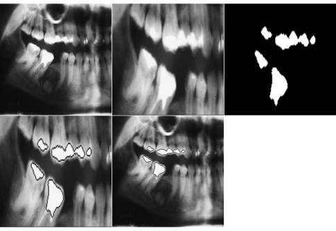
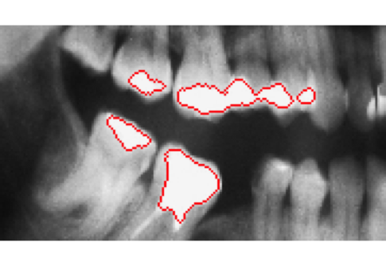

# Dental-X-Ray
Segment, extract, analyze, compare


Dental X-Ray images processing
=============

This repository contains a script for reading, transforming and performing analysis of dental X-ray images.

## Data
Data set contains 2525 high resolution X-Ray images stored in TIFF format. Due to the specific nature of this data set
it is not publicly available.

## Prerequisites
- R 3.5.1

### Packages
- TIFF
- EBImage


```R
source("http://bioconductor.org/biocLite.R")
biocLite("EBImage")
```

Vignette for using EBImage can be found [here] (http://watson.nci.nih.gov/bioc_mirror/packages/2.13/bioc/manuals/EBImage/man/EBImage.pdf).

Tutorial for beginners is available [here] (http://www.bioconductor.org/packages/release/bioc/vignettes/EBImage/inst/doc/EBImage-introduction.pdf)

Paper about analysis of biological images is [here] (http://bioconductor.wustl.edu/bioc/vignettes/EBImage/inst/doc/AnalysisWithEBImage.pdf)

## Pre-processing
1. Choosing a representative set of images
2. Scaling
3. Transforming to gray-scale

[Script] (process.R) performing pre-processing and saving images into final directory.

## Transformations
1. Histogram analysis

## Images
Each step of transformations:



Final result:


